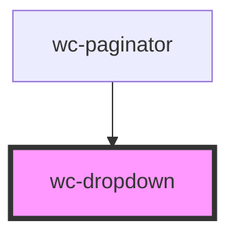

# wc-dropdown

<!-- Auto Generated Below -->

## Properties

| Property   | Attribute  | Description | Type               | Default |
| ---------- | ---------- | ----------- | ------------------ | ------- |
| `disabled` | `disabled` |             | `boolean`          | `false` |
| `label`    | `label`    |             | `string`           | `''`    |
| `name`     | `name`     |             | `string`           | `''`    |
| `required` | `required` |             | `boolean`          | `false` |
| `value`    | `value`    |             | `object \| string` | `''`    |

## Events

| Event          | Description | Type                            |
| -------------- | ----------- | ------------------------------- |
| `selectChange` |             | `CustomEvent<object \| string>` |

## Dependencies

### Used by

 - [wc-paginator](../wc-paginator)

### Graph

----------------------------------------------

*Built with [StencilJS](https://stenciljs.com/)*
