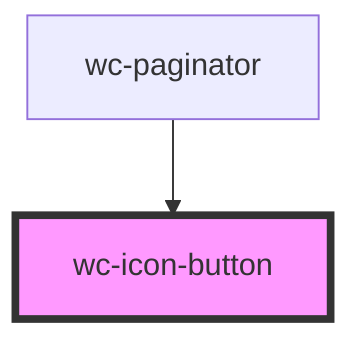

# wc-icon-button

<!-- Auto Generated Below -->

## Properties

| Property           | Attribute           | Description | Type      | Default |
| ------------------ | ------------------- | ----------- | --------- | ------- |
| `dataFirstPage`    | `data-first-page`   |             | `boolean` | `false` |
| `dataLastPage`     | `data-last-page`    |             | `boolean` | `false` |
| `dataNextPage`     | `data-next-page`    |             | `boolean` | `false` |
| `dataPrevPage`     | `data-prev-page`    |             | `boolean` | `false` |
| `disabled`         | `disabled`          |             | `boolean` | `false` |
| `paginationButton` | `pagination-button` |             | `boolean` | `false` |

## Dependencies

### Used by

 - [wc-paginator](../wc-paginator)

### Graph

----------------------------------------------

*Built with [StencilJS](https://stenciljs.com/)*
